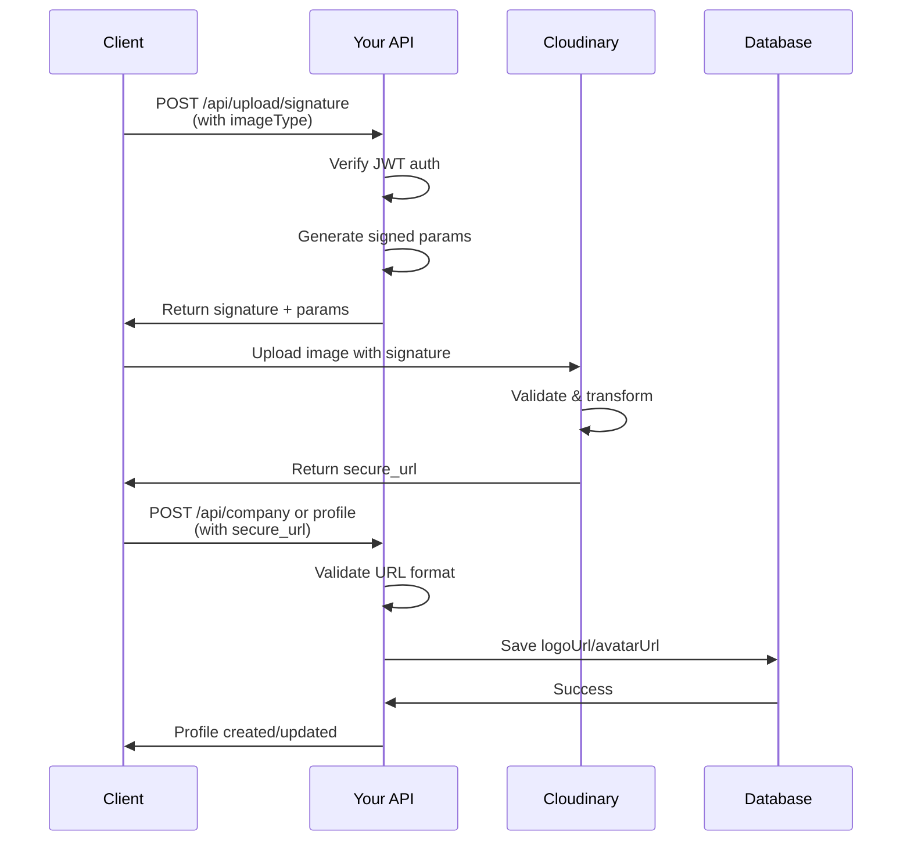

# Cloudinary Image Upload Implementation

## Overview

Implement a secure, signed upload flow where clients upload directly to Cloudinary, then send the returned URL to your API for storage in company profiles and job seeker profiles.

## Architecture Flow



## Implementation Steps

### 1. Install Dependencies

Add the Cloudinary SDK to [`package.json`](package.json):

```bash
npm install cloudinary
```

### 2. Environment Variables

Add to your `.env` file:

```env
CLOUDINARY_CLOUD_NAME=your_cloud_name
CLOUDINARY_API_KEY=your_api_key
CLOUDINARY_API_SECRET=your_api_secret
```

Update [`src/shared/config/env.ts`](src/shared/config/env.ts) to include Cloudinary credentials.

### 3. Create Cloudinary Utility Library

Create `src/lib/cloudinary.ts` with:

- `generateUploadSignature()` - Creates signed upload parameters with timestamp, folder, transformations
- Image transformations: resize to max 1000px, auto format, auto quality, crop to maintain aspect ratio
- Folder structure: `company-logos/` and `job-seeker-avatars/`
- Validation constants: allowed formats (jpg, png, webp), max file size (5MB)

### 4. Create Upload Signature API Endpoint

Create `src/app/api/upload/signature/route.ts`:

- **Method**: POST
- **Auth**: Requires valid JWT Bearer token
- **Body**: `{ imageType: "company-logo" | "job-seeker-avatar" }`
- **Validation**: 
  - Check user role matches imageType (Recruiter for company-logo, Job_finder for avatar)
  - Validate imageType is one of allowed values
- **Response**: 
```json
{
  "signature": "...",
  "timestamp": 1234567890,
  "cloudName": "...",
  "apiKey": "...",
  "folder": "company-logos/",
  "transformation": "c_limit,w_1000,h_1000,q_auto,f_auto"
}
```


### 5. Update Company Profile Endpoint

Modify [`src/app/api/(recruiter)/company/route.ts`](src/app/api/\\\\\\\\\(recruiter)/company/route.ts):

- Add URL validation for `logoUrl` to ensure it's from your Cloudinary domain
- Keep existing validation but enhance URL format check
- No other changes needed - it already accepts logoUrl

### 6. Create/Update Job Seeker Profile Endpoint

Since job seeker profile endpoint might not exist yet:

- Create `src/app/api/(job-seeker)/profile/route.ts` if it doesn't exist
- Similar structure to company endpoint
- Include `avatarUrl` validation for Cloudinary URLs
- Auth: Requires Job_finder role

### 7. Security & Validation

Implement in all endpoints:

- Validate URLs match pattern: `https://res.cloudinary.com/{cloud_name}/...`
- Verify URLs contain correct folder prefix based on user type
- Rate limiting on signature endpoint (max 10 requests per minute per user)

## Files to Create/Modify

**New Files:**

1. `src/lib/cloudinary.ts` - Cloudinary utility functions
2. `src/app/api/upload/signature/route.ts` - Signature generation endpoint
3. `src/app/api/(job-seeker)/profile/route.ts` - Job seeker profile endpoint (if not exists)

**Modified Files:**

1. [`src/shared/config/env.ts`](src/shared/config/env.ts) - Add Cloudinary env vars
2. [`src/app/api/(recruiter)/company/route.ts`](src/app/api/\\\\\\\\\(recruiter)/company/route.ts) - Add URL validation
3. [`package.json`](package.json) - Add cloudinary dependency

## Client Usage Example

```typescript
// 1. Get signature from your API
const { signature, timestamp, cloudName, apiKey, folder, transformation } = 
  await fetch('/api/upload/signature', {
    method: 'POST',
    headers: { 
      'Authorization': `Bearer ${accessToken}`,
      'Content-Type': 'application/json' 
    },
    body: JSON.stringify({ imageType: 'company-logo' })
  }).then(r => r.json());

// 2. Upload to Cloudinary
const formData = new FormData();
formData.append('file', imageFile);
formData.append('signature', signature);
formData.append('timestamp', timestamp);
formData.append('api_key', apiKey);
formData.append('folder', folder);
formData.append('transformation', transformation);

const cloudinaryResponse = await fetch(
  `https://api.cloudinary.com/v1_1/${cloudName}/image/upload`,
  { method: 'POST', body: formData }
).then(r => r.json());

// 3. Save secure_url to your API
await fetch('/api/company', {
  method: 'POST',
  headers: { 
    'Authorization': `Bearer ${accessToken}`,
    'Content-Type': 'application/json' 
  },
  body: JSON.stringify({
    name: 'Company Name',
    // ... other fields
    logoUrl: cloudinaryResponse.secure_url
  })
});
```

## Testing Checklist

- [ ] Signature generation works for both image types
- [ ] Role-based access control (Recruiter can't request job-seeker-avatar signature)
- [ ] Upload to Cloudinary succeeds with generated signature
- [ ] Images are transformed correctly (resized, optimized)
- [ ] Company profile saves valid Cloudinary URLs
- [ ] Job seeker profile saves valid Cloudinary URLs
- [ ] Invalid URLs are rejected
- [ ] Rate limiting prevents abuse